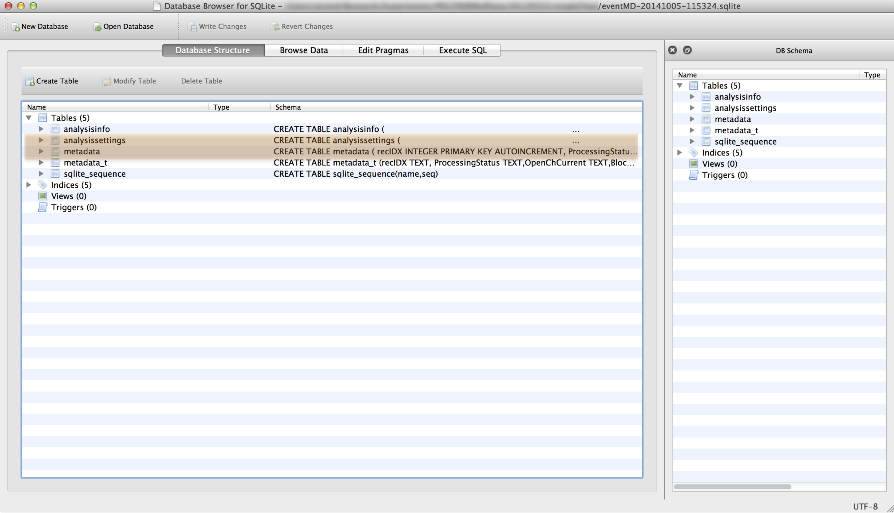

.. _database-page:

Database Structure and Query Syntax
=================================

*<name>* stores the output of an analysis in a `SQLite <http://www.sqlite.org/>`_ database. Database files are stored in the same directory as the data being processed. Each analysis creates a new database file named *eventMD-<date>-<time>.sqlite*, where *<date>* is the date the analysis was performed (e.g. 20140929 for Sep 29, 2014) and *<time>* is the analysis start time (e.g. 112937 for 11:29:37 AM).

`SQLite <http://www.sqlite.org/>`_ databases store data in tables similar to spreadsheets, where each table is analogous to a sheet in an Excel spreadsheet. Databased generated by *<name>* can be inspected using a database viewer, for example the open source `DB browser for SQLite <http://sqlitebrowser.org/>`_.  *<name>* outputs databases with multiple tables as seen from the figure below. Two tables most relevant to the analysis (*metadata* and *analysissettings*) are discussed in detail below. 

.. _metadata-table-sec:

Metadata Table
---------------------------------------------

The *metadata* table contains the primary output of the analysis. *<name>* processes individual blockade events from a time-series of ionic current. The parameters describing each events (or metadata) are stored in individual rows of the *metadata* table in the database file. The column names describe the metadata and are unique to the processing algorithm used. For example, the column names for the :ref:`stepresponse-page` algorithm are shown below. The column names for :ref:`multistate-page` differ from this list. 

.. sourcecode:: javascript

    {
        ProcessingStatus, 
        OpenChCurrent, 
        BlockedCurrent,
        EventStart,
        EventEnd,
        BlockDepth,
        ResTime,
        RiseTime,
        AbsEventStart,
        RedChiSq,
        TimeSeries
    }

Note that the column names can be used in constructing queries passed to SQLite. For example, This is described in more detail in the :ref:`working-with-sqlite-sec` section and the :ref:`scripting-page` section. The first example SQL query below returns the *BlockDepth* column (ratio of *BlockedCurrent* to *OpenChCurrent*). One can imagine assembling more complex queries for example restricting the results to events whose residence time is greater than 0.2 ms as seen from the second example query below.

.. sourcecode:: sql

    select BlockDepth from metadata where ProcessingStatus='normal'

    select BlockDepth from metadata where ProcessingStatus='normal' and ResTime > 0.2

A typical *metadata* table for the :ref:`stepresponse-page` algorithm is shown below. The *ProcessingStatus* column is a text field that should read *normal* if the fit for a particular event was successful. If a failure occurred the corresponding error code (e.g. *eInvalidFitParameters*) is stored and all other columns (except *TimeSeries*) are set to -1. If event time-series storage was requested, then the *TimeSeries* column will store the ionic current data for that entry in binary format.

.. image:: ../images/sqlstructFig2.png
   :width: 600 px
   :align: center

.. _settings-table-sec:

Analysis Settings Table
---------------------------------------------

The *analysissettings* table contains a single text entry that stores the settings file for the analysis. This allows any database opened with the *<name>* GUI to retrieve settings that correspond to the analysis results in the file. As seen from the figure below, the settings file is in the `JSON <http://json.org/>`_ format as described in the :ref:`settings-page` documentation.

.. image:: ../images/sqlstructFig3.png
   :width: 600 px
   :align: center

.. include:: ../doc/WorkingWithSQLite.rst