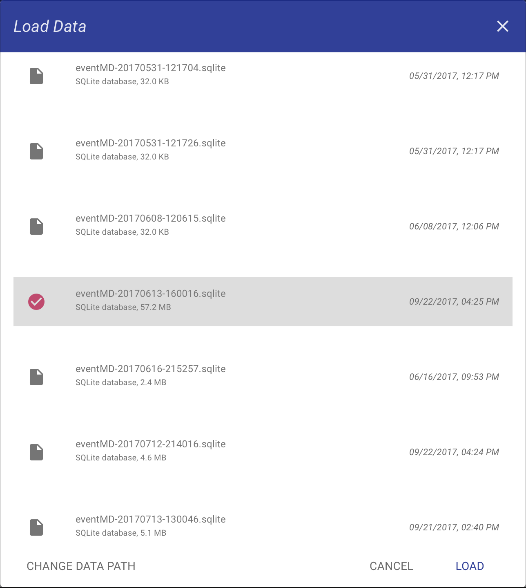
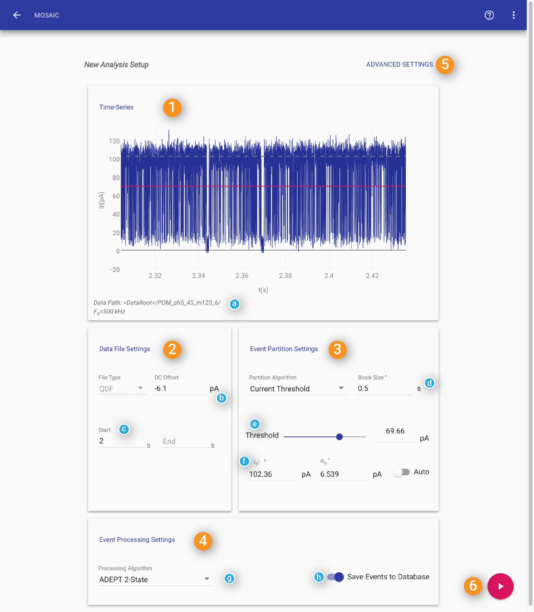
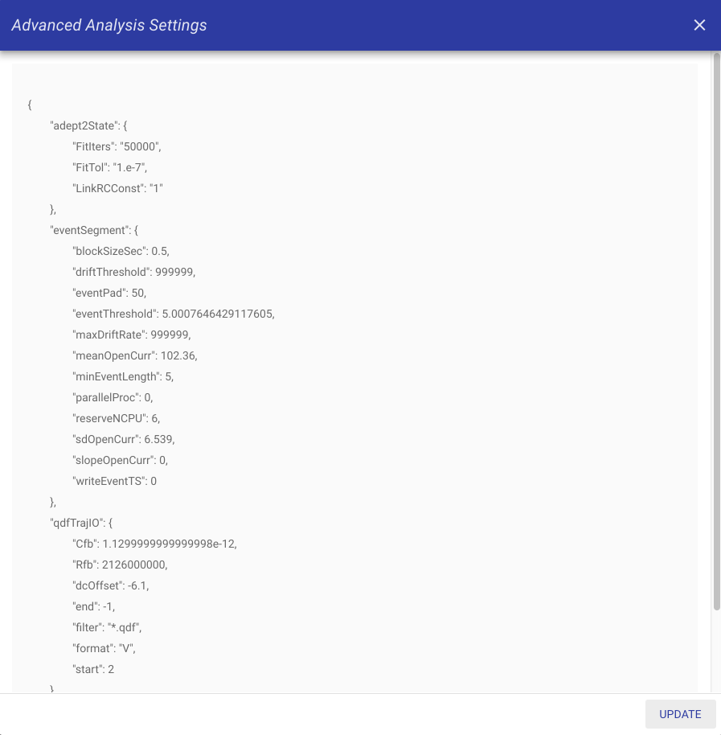
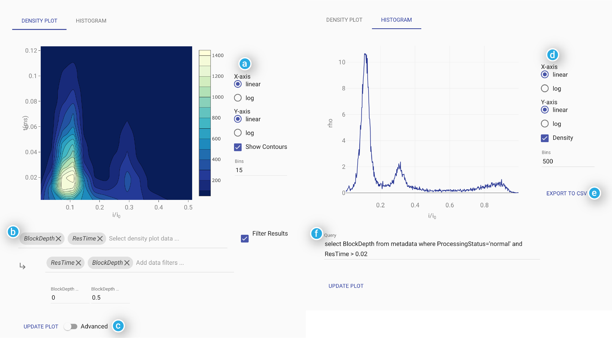
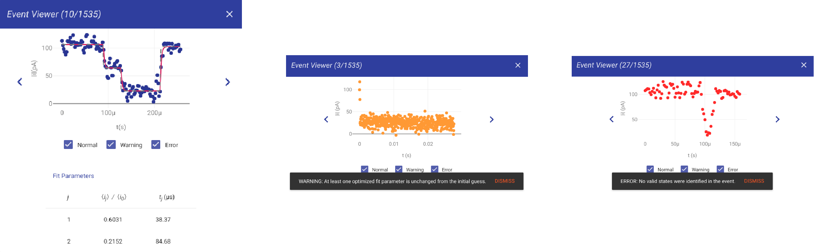

.. _mosaicweb-page:

|projname| WEB
=================================

|projname|'s web interface is designed to allow you to easily setup and run an analysis, or to visualize and analyze the results of previous experiments. It contains the most commonly used features of |projname|.  The web interface consists of a series of screens that allow you to set up and run an analysis. The interface keeps track of all analysis within the current session so it is easy to go back and compare data sets. The web interface is designed to allow you to easily run the most common use cases. For more complicated analysis, please refer to the :ref:`scripting-page` section.

    

**Opening the Web Interface**

The web interface can be run locally, allowing you to run a |projname| analysis from within any modern web browser. If you installed |projname| from a precomiled binary, you can start the web interface by double clicking the |projname| icon. Alternatively, if you compiled |projname| from source code, you can run the GUI from the terminal window -- navigate to the installation directory and type:

.. sourcecode:: console

     python runMOSAIC

This should start a local copy of the |projname| web server and open a new browser window that launches the web interface. Running servers can be accessed at anytime by opening a browser and entering http://localhost:5000 in the adress bar.

Interface Overview
------------------

The main screen of the |projname| web interface is the starting point for running new analyses or reviewing previous runs.  

.. figure:: ../images/mosaicweb/mosaicMain-01.png
  :width: 50 %
  :align: center

  The main screen of the |projname| web interface allows new analyses to be set up or previous runs to be retrieved.

Analysis Settings
##################

The main interface consists of five panels which we go over in detail later in this document. Briefly, these are:

Analysis Results
##################

.. figure:: ../images/mosaicweb/analysisResultsContour-01.png
  :width: 60 %
  :align: center

.. include:: ../aliases.rst