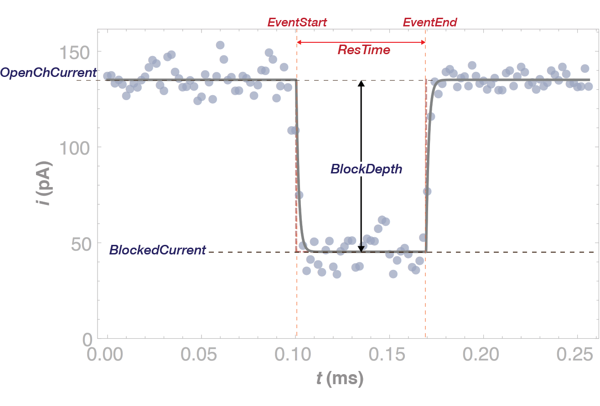

.. _stepresponse-page:

ADEPT 2-State
^^^^^^^^^^^^^^^^^^^^^^^^^^^^^^^^^^^^^^^^^^^^^

This algorithm limits the generalized algorithm for state-detection :cite:`Balijepalli:2014ft` to cases with a single state as seen in the figure below. This simplified approach speeds up the analysis considerably and is appropriate to use for many applications, for example the detection of PEG, small molecules, DNA homopolymers, etc. The :py:class:`~mosaic.adept2State.adept2State` class uses a simplified form of the expression for the ionic current across a nanopore as shown below. Settings that control the fit are defined through the settings file and are described in more detail in the :ref:`algorithm-settings-sec` section. This functional form is fit to a time-series from a single event to recover optimal parameters for the mdoel.

.. math::
    i(t)=i_0 + a \left[ \left(e^{-(t+\mu_1)/\tau} -1\right) H\left(t-\mu_1\right)  + \left(1- e^{-(t+\mu_2)/\tau} \right)H\left(t-\mu_2\right) \right]

This simplification speeds up the analysis for two state events like the PEG event in the figure below. The figure shows the results of the fit (or meta-data) superimposed on the time-series of a single event. 

Algorithm Settings
##########################################
.. exec::
	import mosaic.adept2State

	print mosaic.adept2State.adept2State.__doc__

Metadata Output
##########################################
Meta-data for individual events generated by :py:class:`~mosaic.adept2State.adept2State` can be queried using SQLite_ as described in the :ref:`database-page` section. A list of meta-data stored by the step response algorithm is given below.

.. tabularcolumns:: p{4cm}p{4cm}p{6cm}

+-------------------+-----------------+-------------------------------+
|  **Column Name**  | **Column Type** | **Description**               |
+===================+=================+===============================+
| recIDX            | INTEGER         | Record index.                 |
|                   |                 |                               |
| ProcessingStatus  | TEXT            | Status of the analysis.       |
|                   |                 |                               |
| OpenChCurrent     | REAL            | Open channel current in pA.   |
|                   |                 |                               |
| BlockedCurrent    | REAL            | Blocked state current in pA.  |
|                   |                 |                               |
| EventStart        | REAL            | Event start in ms.            |
|                   |                 |                               |
| EventEnd          | REAL            | Event end in ms.              |
|                   |                 |                               |
| BlockDepth        | REAL            | BlockedCurrent/OpenChCurrent. |
|                   |                 |                               |
| ResTime           | REAL            | EventEnd-EventStart in ms.    |
|                   |                 |                               |
| RCConstant        | REAL            | System RC constant in ms.     |
|                   |                 |                               |
| AbsEventStart     | REAL            | Global event start time in ms.|
|                   |                 |                               |
| ReducedChiSquared | REAL            | Reduced Chi-squared of fit.   |
|                   |                 |                               |
| TimeSeries        | REAL_LIST       | (OPTIONAL) Event time-series. |
+-------------------+-----------------+-------------------------------+

.. include:: ../aliases.rst
